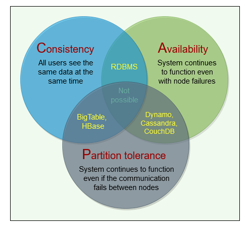

# CAP Theorem

## Background

In distributed systems, different types of failures can occur, e.g.,
servers can crash or fail permanently, disks can go bad resulting in
data losses, or network connection can be lost, making a part of the
system inaccessible. How can a distributed system model itself to get
the maximum benefits out of different resources available?

## Solution

CAP theorem... you know what it is. You can only pick two of three at the time.

Consistency denotes a quality where each nodes will have to talk to same databse. Meaning different clients will fetch and update to same data.

Availability means availability. Does it respond even when a few nodes are failing?

Partition tolerance denotes how much it can tolerate partition. Partition is a break between any two nodes in the system. Such a system will have sufficent replicated data across combination of nodes and network.

https://stackoverflow.com/questions/36404765/why-isnt-rdbms-partition-tolerant-in-cap-theorem-and-why-is-it-available

We cannot build a general data store that is continually available,
sequentially consistent, and tolerant to any partition failures. We can
only build a system that has any two of these three properties. Because,
to be consistent, all nodes should see the same set of updates in the
same order. But if the network loses a partition, updates in one
partition might not make it to the other partitions before a client
reads from the out-of-date partition after having read from the
up-to-date one. The only thing that can be done to cope with this
possibility is to stop serving requests from the out-of-date partition,
but then the service is no longer 100% available.
