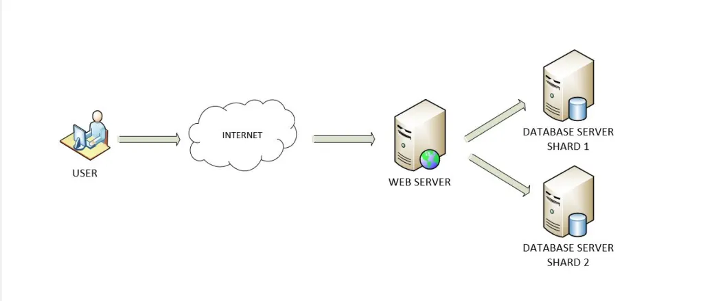
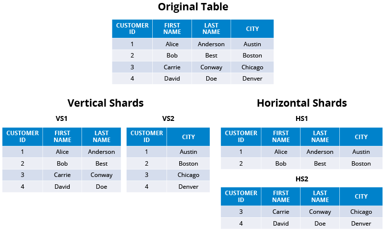
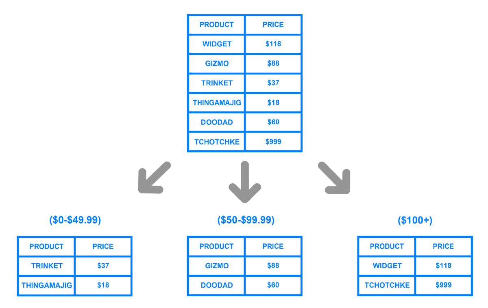

# Data Partitioning

Splitting database into smaller parts for better manageability, performance, availability and load balacning of an application.

When there is only one database your application is bound to experience performance slow downs.



Now we have to make client server talk to our two databases as if it is talking to only one.

## Partitioning Methods

### 1. Horizontal Partitioning (Data Sharding)

Horizontal Partitioning is putting data in two seperate tables. Problem comes in when the standard for splitting the data can cause uneven distribution across the data.

### 2. Vertical Partitioning

For example if one data base has names and other one has pictures of that user profile this is vertical partitioning. Problem comes in when our application gets too big it is necessary to further partition a feature specfic DB across various servers. Also it gets a little bit complex.



### 3. Directory-Based Partitioning



## Partitioning Criteria

### Key or Hash-based Partitioning

It's one way to replace range based partitioning. We apply a hash function to some key attributes of the entity we are storing. For example if we have 100 servers we mod the id by 100 and partition so we can have even distribution across 100 servers.

But problem is that this logic is fixed at 100 servers. So in order to add a new server we need to revise the hash function and comes the downtime which means less availability

### List Partitioning

If a new data contains value that is in the "list of things" that data goes in to that partition. Sort of like directory.

```
if new data in list:
    append(new data)
```

### Round-robin partitioning:

Round robin partitioning...

### Composite Partitioning

MMA of partitioning


## Common Problems of Data Partitioning

First of all, normalization is splitting a table. Meaning, if a row cotnains employee info and customer info, we can split the table into employee table and customer table. That is called normalization. But this causes issues with joins as the data gets large.

### Joins and Denormalization

Denormalizing is adding a redundant data so that it does not have to join. Data inconsistency might occur as we have to keep track of every table where denormalization is existent and update every single one of them.

### Referential integrity

Cross partition query means we have to keep data consistent. Because we have bunch of tables cross referencing, we might have dangling references.

### Rebalancing

Because things are split, the database is prone for unbalance. Data distribution and load could be uneven
