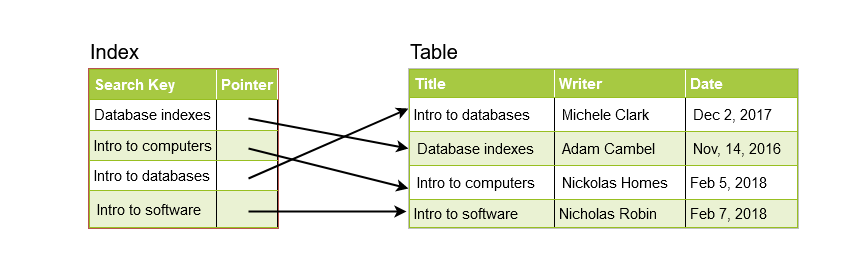

# Indexes

Using indexs can help you optimize database performance

## Example: A library catalog

This method is preferable if the payload is small but the data we have to search is huge.

## How do indexs decrease write performance

Obviously now you have one more table to write. So use this technique if this is read heavy
