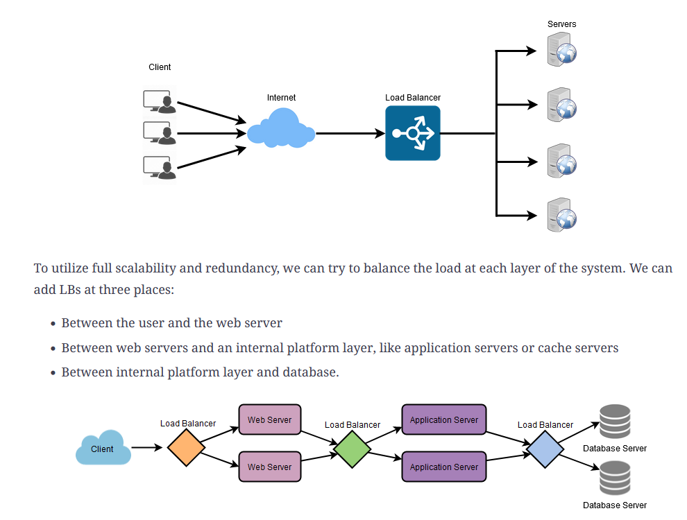

# Load Balancing

## Benefits of Load Balancing

- Better user experience due to better response time
- Because this is a distributed system, even if a full server is down, load balancer will simply redirect to healthier server so more availability and efficiency
- Load is lighter along the servers
- We can get more metrics through load balancers (traffic bottleneck)

## Load Balancing Algorithms

**How does the load balancer choose the back end server?**

1. Make sure the server is healthy
2. Then use its own algorithm to send request to severs

**Health Checks** - Load Balancer sends health check request every interval to see if the server is alive. If alive, use it else remove from the pool of servers which loadbalancer will send the load to.

**Algorithms of Load Balancer**

* **Least Connection Method** — This method directs
  traffic to the server with the fewest active connections. This approach
  is quite useful when there are a large number of persistent client
  connections which are unevenly distributed between the servers.
* **Least Response Time Method** — This algorithm directs traffic to the server with the fewest active connections and the lowest average response time.
* **Least Bandwidth Method** - This method selects the server that is currently serving the least amount of traffic measured in megabits per second (Mbps).
* **Round Robin Method** — This method cycles through a
  list of servers and sends each new request to the next server. When it
  reaches the end of the list, it starts over at the beginning. It is most
  useful when the servers are of equal specification and there are not
  many persistent connections.
* **Weighted Round Robin Method** — The weighted
  round-robin scheduling is designed to better handle servers with
  different processing capacities. Each server is assigned a weight (an
  integer value that indicates the processing capacity). Servers with
  higher weights receive new connections before those with less weights
  and servers with higher weights get more connections than those with
  less weights.
* **IP Hash** — Under this method, a hash of the IP address of the client is calculated to redirect the request to a server

## Redundant Load Balancers

So as you can see load balancer could be the bottleneck. In case of load balancer failure the whole application fails so we need to ad another set of load balancer which is redundnant load balancer.

