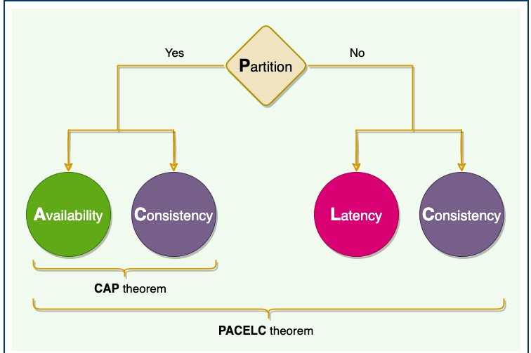

# PACELC Theorem

We cannot avoid partition in a distributed system. ACID compliant databases chose consistency while BASE (Basically Available, Soft-state, Eventually consistent) databases chose availability.

**One place where the CAP theorem is silent is what happens when there is no network partition?** What choices does a distributed system have when there is no partition?

## Solution

If there is partition, choose between availability and consistency.

If there app can run normally even with partition, system can trade off between L and C

## Example

* **Dynamo and Cassandra** are **PA/EL** systems: They choose availability over consistency when a partition occurs; otherwise, they choose lower latency.
* **BigTable and HBase** are **PC/EC** systems: They will always choose consistency, giving up availability and lower latency.
* **MongoDB** can be considered **PA/EC**
  (default configuration): MongoDB works in a primary/secondaries
  configuration. In the default configuration, all writes and reads are
  performed on the primary. As all replication is done asynchronously
  (from primary to secondaries), when there is a network partition in
  which primary is lost or becomes isolated on the minority side, there is
  a chance of losing data that is unreplicated to secondaries, hence
  there is a loss of consistency during partitions. Therefore it can be
  concluded that**in the case of a network partition, MongoDB chooses availability, but otherwise guarantees consistency** .
  Alternately, when MongoDB is configured to write on majority replicas
  and read from the primary, it could be categorized as PC/EC.
