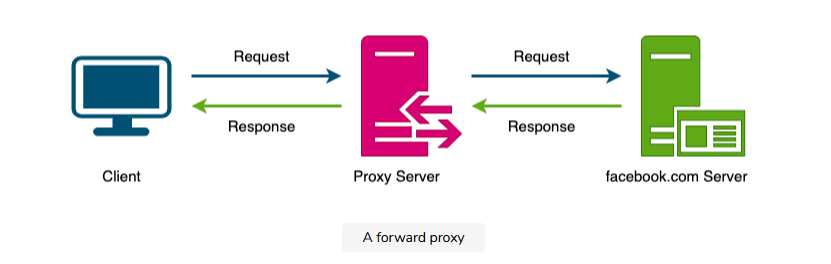
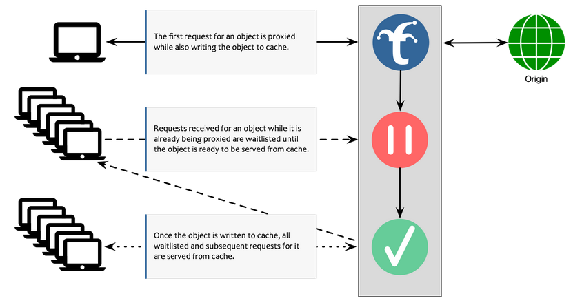
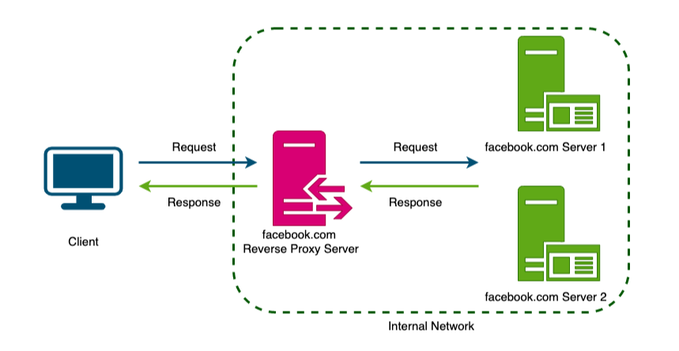

# Proxies

## What is a proxy server

A proxy server is an intermediate piece of software or hardware that sits between the client and the server.

Anonymize the client from the server

Proxies can also combine mutiple data and send as one.

**Collapsed Forwarding**

This is when data is not in the cache. So we will wait until the requested data is in cache and then return the response.

## Reverse Proxy

A reverse proxy retrieves resources from multiple servers on behalf of servers.

A reverse proxy, just like a forward proxy can be used for caching load balancing or routing request to the appropriate servers.

## Summary

A proxy is a piece of software or hardware that is in between client and server.
