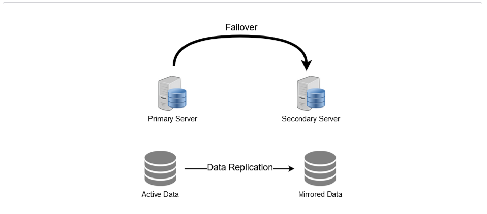

## Redundancy and Replication

Redundancy is a duplication within the system and replication is process of replicating so that there is consistency between redundant resources.

This whole process is to reduce fault-tolerance.
